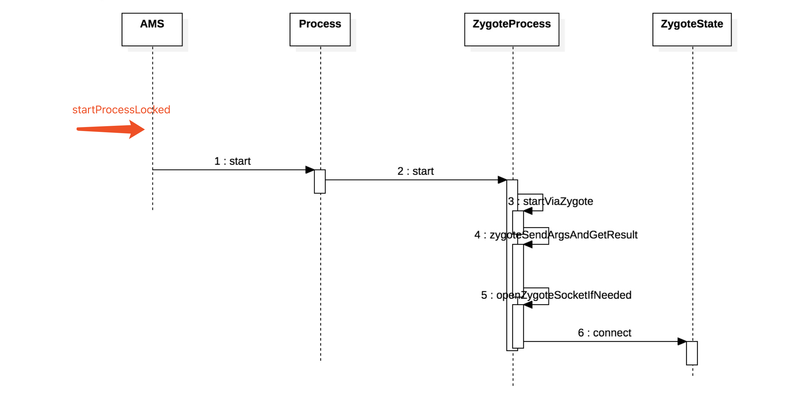
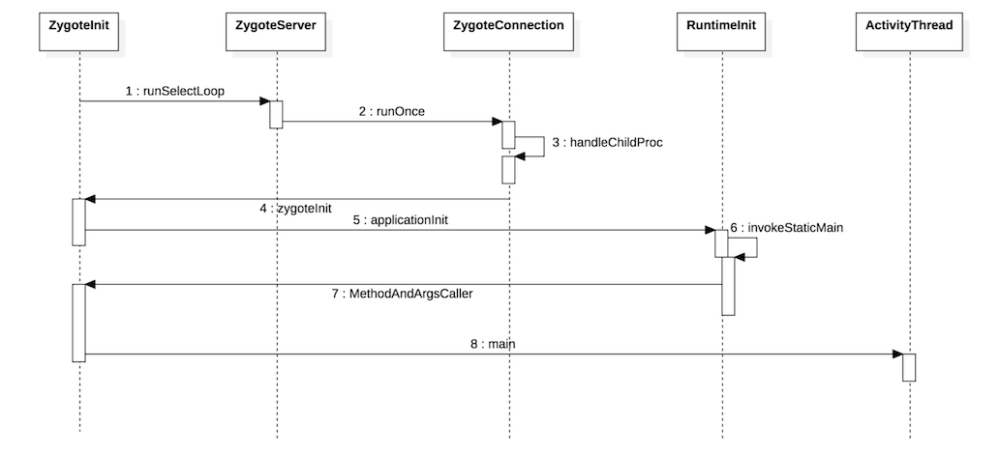

# 应用程序进程（AppProcess)启动

> 启动一个应用程序首先要保证该应用程序的进程已经被启动。AMS在启动应用程序时，会先检查应用程序进程是否存在，如果不存在就需要请求Zygote进程创建并启动应用程序进程。

## 启动大纲

1. AMS发送启动应用程序进程请求.

2. Zygote接收请求并创建应用程序进程.

### AMS发送启动应用程序进程请求

* AMS通过调用[startProcessLocked](http://androidxref.com/9.0.0_r3/xref/frameworks/base/services/core/java/com/android/server/am/ActivityManagerService.java#4188)方法向Zygote进程发送请求。

* [Process](http://androidxref.com/9.0.0_r3/xref/frameworks/base/core/java/android/os/Process.java#479)调用`start`方法，使用[ZygoteProcess](http://androidxref.com/9.0.0_r3/xref/frameworks/base/core/java/android/os/ZygoteProcess.java#220)的`start`方法。

* 在ZygoteProcess的`start`方法中，先后调用了`startViaZygote`、`zygoteSendArgsAndGetResult`和`openZygoteSocketIfNeeded`等方法，最后在`openZygoteSocketIfNeeded`方法中调用了[ZygoteState](http://androidxref.com/9.0.0_r3/xref/frameworks/base/core/java/android/os/ZygoteProcess.java#106)的connect方法建立与Zygote进程的连接。

### AMS发送启动应用程序进程请求

* [ZygoteServer](http://androidxref.com/9.0.0_r3/xref/frameworks/base/core/java/com/android/internal/os/ZygoteServer.java#173)执行`runSelectLoop`方法，一直等待AMS的请求数据到来。

* 当AMS请求到来，与Zygote进程建立连接后，由[ZygoteConnection](http://androidxref.com/9.0.0_r3/xref/frameworks/base/core/java/com/android/internal/os/ZygoteConnection.java#123)的`processOneCommand`方法处理请求的数据。对请求数据进行解析，获取程序进程的启动参数，并通过[Zygote](http://androidxref.com/9.0.0_r3/xref/frameworks/base/core/java/com/android/internal/os/Zygote.java#133)的forkAndSpecialize方法进行应用程序进程的创建。

* 进程创建完成后，交由[ZygoteInit](http://androidxref.com/9.0.0_r3/xref/frameworks/base/core/java/com/android/internal/os/ZygoteInit.java#902)的`zygoteInit`方法和[RuntimeInit](http://androidxref.com/9.0.0_r3/xref/frameworks/base/core/java/com/android/internal/os/RuntimeInit.java#345)的`applicationInit`方法分别进行进程和应用的初始化。在`zygoteInit`方法中，为应用程序进程创建了Binder线程池，这样进程就可以跨进程进行通信了。而`applicationInit`方法通过反射最终会调用[ActivityThread](http://androidxref.com/9.0.0_r3/xref/frameworks/base/core/java/android/app/ActivityThread.java#6623)的`main`方法，从而完成应用程序进程的创建。